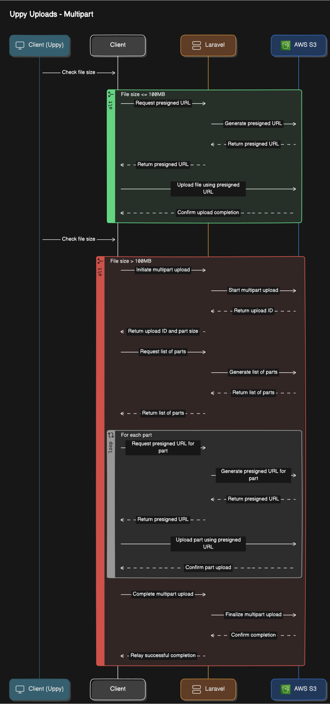

# How Uppy Works with Amazon S3

When using Uppy for file uploads to Amazon S3, there are two primary methods:

1. Direct Upload
2. Multipart Upload.

This document explains both methods, their use cases, and how Uppy v4 automatically switches between them.

## 1. Direct Upload (Pre-signed URL method)

Direct upload is a method of uploading files directly to Amazon S3 in one step.

Direct Upload uses a pre-signed URL that Amazon s3 has assigned and allows the client to upload files directly to S3 without needing AWS credentials attached to the request.

### How it works:
1. The client (Uppy in the frontend) requests a pre-signed URL from the backend (Laravel).
2. The backend generates a pre-signed URL using AWS SDK and sends it back to the client.
3. Uppy uses this pre-signed URL to upload the file directly to S3.
4. S3 receives and stores the file.

### Use cases:
- Smaller files (typically less than 100 MB)
- Secure direct uploads without exposing AWS credentials to the client
- Reduced server load as the file doesn't pass through the backend

### Diagram:

## 2. Multipart Upload

Multipart Upload is a more complex but powerful method that breaks down large files into smaller parts for upload.

In a similar way to the direct upload, uppy will need presigned URLs for each part of the upload and the client will upload directly
to S3.

Typically, Multipart uploads are also used as it allows Uppy to pause and resume uploads (important for large files).

### How it works:
1. The client (Uppy) initiates a multipart upload request to the backend (Laravel).
2. The backend starts a multipart upload session with S3 and returns the upload ID and other necessary information.
3. Uppy divides the file into multiple parts.
4. For each part, Uppy requests a pre-signed URL from the backend.
5. Uppy uploads each part directly to S3 using the pre-signed URLs.
6. After all parts are uploaded, Uppy notifies the backend.
7. The backend sends a completion request to S3.
8. S3 combines all the parts into the final object.

### Use cases:
- Large files (recommended for files larger than 100 MB)
- Improved upload performance through parallel uploads
- Ability to pause and resume uploads

## Diagram

## Uppy v4

Uppy v4 introduces an intelligent feature that automatically switches between Direct Upload and Multipart Upload modes based on file size:

- For files smaller than 100 MB: Uppy uses the Direct Upload method.
- For files 100 MB or larger: Uppy automatically switches to the Multipart Upload method.

This automatic switching ensures optimal upload performance and efficiency without requiring manual configuration. It combines the simplicity of direct uploads for smaller files with the robustness of multipart uploads for larger files.

For more detailed information on S3 uploads and pre-signed URLs, please refer to the [AWS S3 documentation](https://docs.aws.amazon.com/AmazonS3/latest/userguide/PresignedUrlUploadObject.html).
